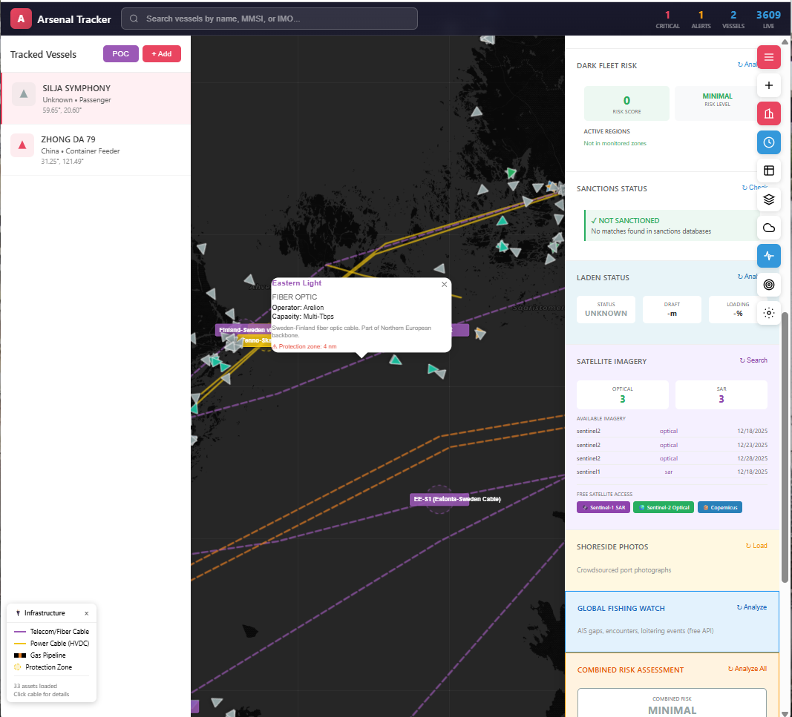
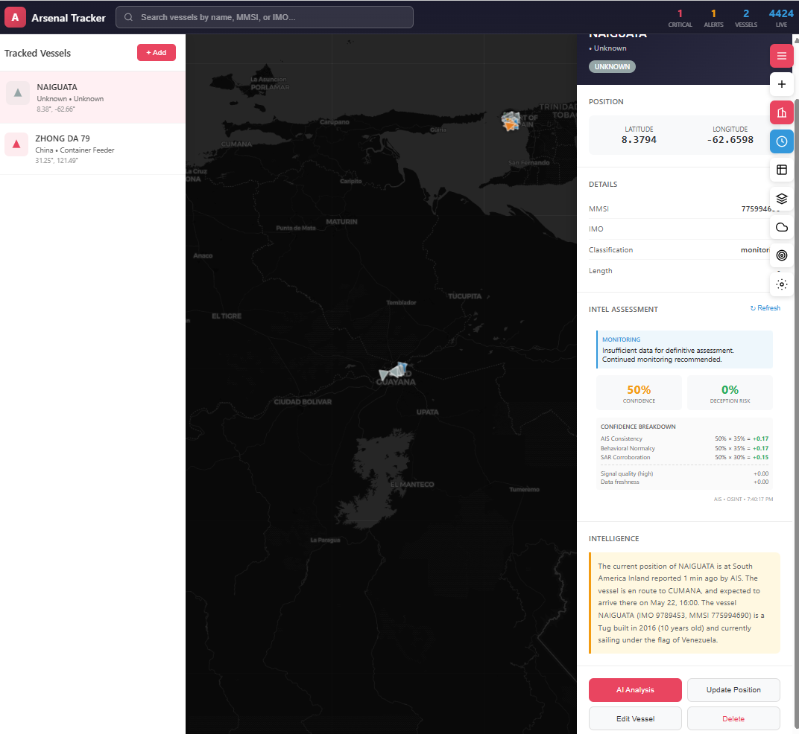
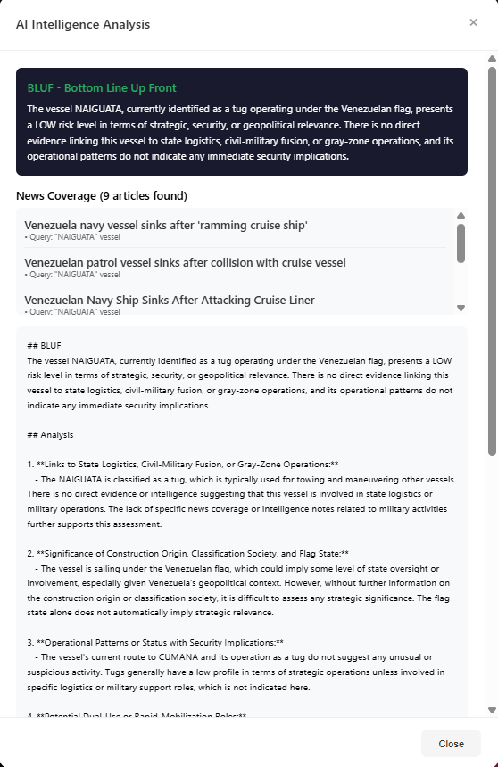
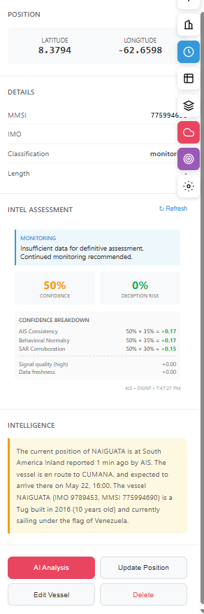
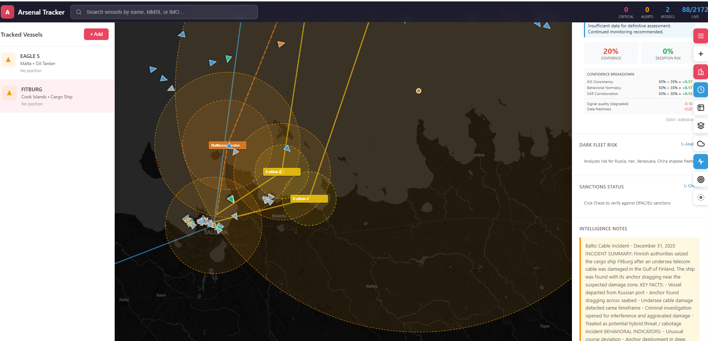

# Arsenal Ship Tracker


Maritime gray zone monitoring system for tracking vessels suspected of civilian-to-military conversion, containerized weapons systems, and dual-use activity.

## Live Demo

**[View Static Demo on GitHub Pages](https://arandomguyhere.github.io/AIS_Tracker/)**

## Screenshots

### Dashboard

*Main tracking interface with vessel markers, confidence scoring breakdown, and threat assessment panel*

### Track Live Vessel

*Add any AIS vessel to your tracking database by MMSI*

### AI Intelligence Analysis

*OpenAI-powered strategic intelligence with MMSI lookups and news correlation*

### Intelligence Results

*BLUF assessment with risk level, confidence breakdown, and analyst-visible indicators*

## Overview

This proof-of-concept tracker monitors vessels like **ZHONG DA 79** - a Chinese container feeder converted to an arsenal ship carrying 60+ containerized missiles, CIWS, and radar while retaining civilian classification.

## Features

### Core Tracking
- **VesselFinder-style UI** - Full-screen dark map with slide-in panels
- **Live AIS streaming** - Real-time vessel positions via aisstream.io WebSocket
- **Multi-source AIS** - Support for AISStream, AISHub, and Marinesia APIs
- **Ship markers with heading** - Vessel icons rotate based on course
- **Vessel-type color coding** - Different colors for cargo, tanker, passenger, military, etc.
- **Viewport-optimized rendering** - Handles 10,000+ live vessels without browser lag
- **SQLite WAL mode** - Better concurrent database access

### Vessel Management
- **Add/Edit/Delete vessels** - Full CRUD operations with UI forms
- **Track live vessels** - Add any AIS vessel to your tracking database
- **Photo upload** - Attach vessel images with base64 storage
- **Comprehensive vessel forms** - Track weapons config, classification, threat levels
- **MMSI-based enrichment** - Auto-populate vessel data from tracking databases

### Intelligence Features
- **AI-powered vessel analysis** - OpenAI integration for strategic intelligence
- **MMSI vessel lookups** - Query VesselFinder, MarineTraffic, ITU MARS databases
- **Auto-update fields** - Automatically populate flag, type, IMO from lookups
- **Targeted search queries** - Uses exact vessel names and IMO for accurate results
- **BLUF assessments** - Bottom Line Up Front risk analysis (LOW/MODERATE/HIGH/CRITICAL)
- **Analysis persistence** - Save and retrieve AI analysis for each vessel
- **News correlation** - Automated news search with relevance filtering
- **OSINT integration** - Link to news articles and intelligence reports

### Weather & Environment
- **Weather enrichment** - Open-Meteo API integration (no API key required)
- **Marine conditions** - Wave height, sea state, swell data
- **Vessel weather** - Get weather at any vessel's current position

### Geospatial
- **Shipyard geofences** - Monitor vessel proximity to facilities of interest
- **Position tracking** - Historical vessel track display
- **Bounding box configuration** - Define AIS streaming areas via UI

### SAR Ship Detection (NEW)
- **ESA SNAP integration** - Import ship detections from ESA Sentinel-1 SAR imagery
- **CSV/XML parsing** - Parse SNAP Ship Detection toolbox output files
- **AIS correlation** - Match SAR detections with AIS positions (configurable time/distance thresholds)
- **Dark vessel detection** - Identify vessels visible on SAR but not transmitting AIS
- **Detection metadata** - Track detection time, coordinates, estimated length, confidence
- **SAR layer toggle** - View SAR detections on map (purple=matched, red=dark vessel)
- **EO Browser integration** - One-click access to Sentinel-1 SAR imagery for current map view
- **Satellite overlay** - NASA daily satellite imagery with adjustable opacity

### Vessel Confidence Scoring (NEW)
- **AIS consistency score** - Analyze position reporting gaps and jumps
- **Behavioral normalcy score** - Detect unusual speed/course changes
- **SAR corroboration score** - Cross-reference with SAR detections
- **Deception likelihood** - Calculate probability of AIS spoofing/manipulation
- **Overall confidence** - Weighted composite score (0.0-1.0)
- **Cached scoring** - Scores cached and refreshable on demand
- **UI confidence panel** - Visual confidence display in vessel details with refresh button

### Testing
- **173 unit tests** - Comprehensive test coverage
- **Test runner** - `python3 run_tests.py` to run all tests
- **Module tests** - Database, API, SAR import, confidence scoring, intelligence

## Quick Start

```bash
# Install dependencies
pip install -r requirements.txt

# Initialize database with seed data
python3 server.py init

# Start live AIS streaming (in separate terminal)
python3 stream_area.py

# Start the web server
python3 server.py

# Open http://localhost:8080 in browser
```

### Environment Variables

```bash
# Required for AI intelligence features
export OPENAI_API_KEY="your-openai-api-key"

# Required for live AIS streaming (primary source)
export AISSTREAM_API_KEY="your-aisstream-api-key"

# Optional: AISHub community data sharing (register at aishub.net)
export AISHUB_USERNAME="your-aishub-username"
```

## Components

| File | Description |
|------|-------------|
| `server.py` | REST API server with vessel intel, weather & news search |
| `vessel_intel.py` | AI-powered vessel intelligence with MMSI lookups |
| `weather.py` | Weather enrichment via Open-Meteo API |
| `stream_area.py` | Live AIS streaming from aisstream.io |
| `schema.sql` | SQLite database schema + seed data |
| `static/index.html` | VesselFinder-style interactive dashboard |
| `docs/index.html` | Static GitHub Pages demo version |
| `requirements.txt` | Python dependencies (gnews, openai) |
| `ais_ingest.py` | AIS data ingestion module |
| `ais_config.json` | AIS source configuration (auto-created) |
| `ais_sources/` | Multi-source AIS integration (AISStream, AISHub, Marinesia) |
| `osint/` | OSINT correlation and monitoring tools |
| `sar_import.py` | SAR ship detection import and AIS correlation |
| `confidence.py` | Vessel confidence scoring and deception detection |
| `intelligence.py` | Formal intelligence output with analyst-visible breakdown |
| `behavior.py` | Behavior detection: loitering, AIS gaps, STS transfers, dark fleet scoring |
| `venezuela.py` | Venezuela dark fleet detection: zone monitoring, AIS spoofing, risk scoring |
| `sanctions.py` | Sanctions database: FleetLeaks API, OFAC SDN, vessel compliance checking |
| `infra_analysis.py` | Infrastructure threat analysis: anchor drag, cable proximity, incident correlation |
| `laden_status.py` | Laden status detection: draft analysis, cargo operations, STS transfer detection |
| `satellite_intel.py` | Satellite imagery integration: Sentinel-1/2, vessel detection, storage monitoring |
| `shoreside_photos.py` | Crowdsourced photography: port photos, vessel verification, intel collection |
| `run_tests.py` | Test runner script |
| `tests/` | Unit tests for database, API, SAR, confidence, intelligence, Venezuela, sanctions |

## API Endpoints

### Vessel Operations

| Method | Endpoint | Description |
|--------|----------|-------------|
| GET | `/api/vessels` | All vessels with latest position |
| GET | `/api/vessels/:id` | Single vessel details |
| GET | `/api/vessels/:id/track?days=90` | Position history |
| GET | `/api/vessels/:id/events` | Event timeline |
| POST | `/api/vessels` | Add vessel |
| PUT | `/api/vessels/:id` | Update vessel |
| DELETE | `/api/vessels/:id` | Delete vessel |
| POST | `/api/vessels/:id/position` | Log position |
| POST | `/api/vessels/:id/event` | Log event |
| POST | `/api/track-vessel` | Add live vessel to tracking |

### Intelligence Operations

| Method | Endpoint | Description |
|--------|----------|-------------|
| GET | `/api/vessels/:id/intel` | Formal intelligence assessment with breakdown |
| GET | `/api/vessels/:id/intel?summary=true` | Quick intel summary |
| POST | `/api/vessel-intel` | Full AI analysis with news search |
| POST | `/api/vessel-bluf` | Quick BLUF risk assessment |
| POST | `/api/search-news` | Search Google News for vessel |
| GET | `/api/osint?vessel_id=1` | OSINT reports |
| POST | `/api/osint` | Add OSINT report |

### Weather Endpoints

| Method | Endpoint | Description |
|--------|----------|-------------|
| GET | `/api/weather?lat=31.2&lon=121.4` | Weather at coordinates |
| GET | `/api/vessels/:id/weather` | Weather at vessel position |

### SAR Detection Endpoints

| Method | Endpoint | Description |
|--------|----------|-------------|
| GET | `/api/sar-detections` | List SAR ship detections |
| GET | `/api/dark-vessels` | List dark vessels (SAR without AIS match) |

### Confidence Scoring Endpoints

| Method | Endpoint | Description |
|--------|----------|-------------|
| GET | `/api/vessels/:id/confidence` | Get cached confidence score |
| GET | `/api/vessels/:id/confidence?refresh=true` | Calculate fresh confidence score |

### Venezuela Dark Fleet Endpoints

| Method | Endpoint | Description |
|--------|----------|-------------|
| GET | `/api/venezuela/config` | Monitoring zone configuration |
| GET | `/api/venezuela/known-vessels` | Known dark fleet vessels database |
| GET | `/api/vessels/:id/venezuela` | Full risk analysis (zone, score, alerts) |

### Sanctions Database Endpoints

| Method | Endpoint | Description |
|--------|----------|-------------|
| GET | `/api/sanctions/check?imo=X` | Check vessel by IMO |
| GET | `/api/sanctions/check?name=X` | Check vessel by name |
| GET | `/api/sanctions/stats` | Database statistics |
| GET | `/api/vessels/:id/sanctions` | Vessel sanctions status |

### Other Endpoints

| Method | Endpoint | Description |
|--------|----------|-------------|
| GET | `/api/shipyards` | Monitored facilities |
| GET | `/api/events?severity=critical&limit=50` | All events (filterable) |
| GET | `/api/alerts` | Unacknowledged alerts |
| GET | `/api/watchlist` | Watchlist with vessel details |
| GET | `/api/stats` | Dashboard statistics |
| GET | `/api/live-vessels` | Live AIS streaming vessels |
| GET | `/api/vessels/:id/analysis` | Get saved AI analysis |
| POST | `/api/alerts/:id/acknowledge` | Acknowledge alert |
| POST | `/api/config/bounding-box` | Save AIS bounding box config |
| POST | `/api/vessels/:id/photo` | Upload vessel photo |

### Example API Calls

```bash
# Get all vessels
curl http://localhost:8080/api/vessels

# Full AI analysis for a vessel
curl -X POST http://localhost:8080/api/vessel-intel \
  -H "Content-Type: application/json" \
  -d '{"vessel": {"name": "ZHONG DA 79", "mmsi": "413000000", "vessel_type": "Container Feeder", "flag_state": "China"}}'

# Quick BLUF assessment
curl -X POST http://localhost:8080/api/vessel-bluf \
  -H "Content-Type: application/json" \
  -d '{"vessel": {"name": "ZHONG DA 79", "classification": "confirmed", "threat_level": "critical"}}'

# Add position update
curl -X POST http://localhost:8080/api/vessels/1/position \
  -H "Content-Type: application/json" \
  -d '{"latitude": 31.24, "longitude": 121.49, "source": "manual"}'

# Update vessel
curl -X PUT http://localhost:8080/api/vessels/1 \
  -H "Content-Type: application/json" \
  -d '{"threat_level": "critical", "intel_notes": "Updated intelligence"}'

# Get vessel confidence score
curl http://localhost:8080/api/vessels/1/confidence

# Get SAR detections
curl http://localhost:8080/api/sar-detections

# Get dark vessels (SAR without AIS)
curl http://localhost:8080/api/dark-vessels

# Get Venezuela monitoring config
curl http://localhost:8080/api/venezuela/config

# Get known dark fleet vessels
curl http://localhost:8080/api/venezuela/known-vessels

# Check vessel sanctions by name
curl "http://localhost:8080/api/sanctions/check?name=SKIPPER"

# Get sanctions database statistics
curl http://localhost:8080/api/sanctions/stats
```

## AI Intelligence Features

The vessel intelligence module (`vessel_intel.py`) provides:

### MMSI-Based Vessel Lookups
When you run AI Analysis, the system queries multiple vessel tracking databases:
- **VesselFinder** - Vessel details, IMO, flag
- **MarineTraffic** - Comprehensive vessel data, dimensions, year built
- **ITU MARS** - Official MMSI registry with owner information
- **MyShipTracking** - Additional vessel data

### Auto-Update Fields
After analysis, the system automatically updates the vessel record with:
- Flag state, vessel type, IMO number
- Callsign, owner, dimensions
- Classification and threat level recommendations

### Targeted Search Queries
Improved search accuracy with:
- Exact vessel name searches: `"GRACEFUL STARS" vessel`
- IMO-based searches: `IMO 9123456 ship`
- Relevance filtering (only shows articles mentioning the vessel)

### Strategic Analysis
Full vessel analysis with structured output:
- State logistics and civil-military fusion assessment
- Construction origin and flag state significance
- Operational patterns and security implications
- Dual-use and rapid-mobilization potential
- News coverage analysis

### Risk Levels
- **LOW** - No significant concerns
- **MODERATE** - Some factors warrant monitoring
- **HIGH** - Significant security implications
- **CRITICAL** - Immediate attention required

### Analysis Persistence
- AI analysis results are saved to the database
- BLUF summaries are extracted and stored
- Retrieve previous analysis via `/api/vessels/:id/analysis`

## SAR Ship Detection

The SAR import module (`sar_import.py`) enables integration with ESA Sentinel-1 SAR imagery:

### Supported Formats
- **CSV** - SNAP Ship Detection toolbox CSV export
- **XML** - SNAP detection XML output

### Detection Fields
| Field | Description |
|-------|-------------|
| `detection_time` | Timestamp of SAR image acquisition |
| `latitude/longitude` | Detection coordinates |
| `estimated_length` | Estimated vessel length in meters |
| `detection_confidence` | Algorithm confidence score |
| `matched_mmsi` | AIS vessel if correlation found |

### AIS Correlation
Detections are correlated with AIS positions using configurable thresholds:
- **Time window**: ±30 minutes (default)
- **Distance threshold**: 5km (default)
- Unmatched detections flagged as potential "dark vessels"

### Usage
```python
from sar_import import import_sar_file, get_dark_vessels

# Import SNAP detection file
results = import_sar_file('detections.csv', source='sentinel-1')

# Get vessels detected by SAR but not transmitting AIS
dark_vessels = get_dark_vessels(since='2025-01-01')
```

## Vessel Confidence Scoring

The confidence module (`confidence.py`) provides trust assessment for vessel data:

### Score Components
| Component | Weight | Description |
|-----------|--------|-------------|
| AIS Consistency | 40% | Position reporting regularity, gap analysis |
| Behavioral Normalcy | 30% | Speed/course change patterns |
| SAR Corroboration | 30% | Cross-reference with SAR detections |

### Scoring Algorithm
- **AIS Consistency**: Penalizes large gaps (>1hr) and position jumps (>50nm)
- **Behavioral Normalcy**: Flags unusual speed (>30kt) or rapid course changes
- **SAR Corroboration**: Boosts score when SAR confirms vessel presence
- **Deception Likelihood**: Combines factors indicating potential AIS manipulation

### API Response
```json
{
  "vessel_id": 1,
  "overall_confidence": 0.72,
  "ais_consistency": 0.85,
  "behavioral_normalcy": 0.65,
  "sar_corroboration": 0.50,
  "deception_likelihood": 0.15,
  "calculated_at": "2025-12-31T00:00:00Z"
}
```

## Behavior Detection & Dark Fleet Analysis

The behavior detection module (`behavior.py`) provides vessel behavior analysis based on peer-reviewed research:

### Detection Capabilities
| Detection | Description | Reference |
|-----------|-------------|-----------|
| **AIS Gaps** | Identify vessels "going dark" | Global Fishing Watch (2024) |
| **Loitering** | Detect stationary behavior indicating STS transfers | GFW Nature Study |
| **Position Spoofing** | Flag impossible vessel movements | MDPI (2021) |
| **STS Transfers** | Ship-to-ship transfer detection | arXiv (2024) |
| **Dark Fleet Score** | Multi-factor risk assessment | MDPI (2023, 2025) |

### Dark Fleet Risk Scoring
Combines multiple indicators based on shadow fleet research:
- **Flag of Convenience** (0-25 pts) - FOC and emerging shadow fleet flags
- **Vessel Age** (0-20 pts) - Old vessels (>15-25 years) common in shadow fleets
- **Ownership Opacity** (0-15 pts) - Shell companies, hidden ownership
- **AIS Gaps** (0-20 pts) - Primary shadow fleet tactic
- **Position Spoofing** (0-15 pts) - Intentional deception
- **STS Transfers** (0-15 pts) - Sanctions evasion indicator
- **Vessel Type** (0-5 pts) - Tankers higher risk

### Risk Levels
| Score | Level | Assessment |
|-------|-------|------------|
| 70-100 | Critical | High probability of shadow fleet involvement |
| 50-69 | High | Multiple dark fleet indicators present |
| 30-49 | Medium | Some concerning indicators detected |
| 15-29 | Low | Minor risk factors present |
| 0-14 | Minimal | No significant dark fleet indicators |

### API Endpoints
| Method | Endpoint | Description |
|--------|----------|-------------|
| GET | `/api/vessels/:id/behavior` | Full behavior analysis |
| GET | `/api/mmsi/validate?mmsi=XXX` | MMSI validation |
| GET | `/api/mmsi/country?mmsi=XXX` | Flag country lookup |

## Venezuela Dark Fleet Detection (NEW)

Real-time monitoring for sanctioned vessel activity in Venezuelan waters, based on commercial intelligence methodologies (Kpler, Windward, TankerTrackers).

### Background
- **920+ sanctioned tankers** globally, ~40% serving Venezuela
- **95% YoY increase** in high-risk tanker presence in Caribbean (2025)
- **Detection-to-interdiction transition**: U.S. now physically seizing vessels

### Monitoring Zones

| Location | Coordinates | Type | Risk |
|----------|-------------|------|------|
| Jose Terminal | 10.15°N, 64.68°W | Terminal | Critical |
| La Borracha | 10.08°N, 64.89°W | STS Zone | Critical |
| Barcelona STS | 10.12°N, 64.72°W | STS Zone | High |
| Amuay Refinery | 11.74°N, 70.21°W | Refinery | High |

### Detection Capabilities

| Detection | Method | Based On |
|-----------|--------|----------|
| **AIS Spoofing** | Satellite-AIS position comparison | Skipper case study |
| **Circle Spoofing** | Geometric pattern analysis | GNSS manipulation research |
| **Going Dark** | AIS transmission gap detection | GFW methodology |
| **Identity Laundering** | Scrapped vessel database cross-reference | "Zombie vessel" detection |
| **STS Transfers** | Vessel proximity + loitering analysis | arXiv 2024 |

### Known Dark Fleet Vessels

| Vessel | Status | Notes |
|--------|--------|-------|
| Skipper | Seized | 80+ days AIS spoofing, Iran-Venezuela-China route |
| Centuries | Seized | December 2025 |
| Bella 1 | Pursued | Currently tracked by U.S. Navy |

### High-Risk Flags (Venezuela)
Cameroon, Gabon, Palau, Marshall Islands, São Tomé and Príncipe, Equatorial Guinea, Comoros, Togo, Tanzania, Djibouti

### API Endpoints

| Method | Endpoint | Description |
|--------|----------|-------------|
| GET | `/api/venezuela/config` | Get monitoring zone configuration |
| GET | `/api/venezuela/known-vessels` | List known dark fleet vessels |
| GET | `/api/vessels/:id/venezuela` | Full Venezuela risk analysis for vessel |

### Example: Skipper Detection

```python
from venezuela import (
    detect_ais_spoofing,
    calculate_venezuela_risk_score,
    check_venezuela_alerts
)

# Detect AIS spoofing (Skipper showed Guyana, was at Jose)
ais_positions = [{"lat": 7.5, "lon": -57.5, "timestamp": "..."}]
sat_positions = [{"lat": 10.15, "lon": -64.68, "timestamp": "..."}]
spoofing = detect_ais_spoofing(ais_positions, sat_positions, mmsi)
# Returns: 550km discrepancy, severity=critical

# Calculate risk score
risk = calculate_venezuela_risk_score(
    mmsi="123456789",
    vessel_info={"name": "Skipper", "flag_state": "Cameroon"}
)
# Returns: score=70+, risk_level=critical

# Check alerts for vessel in Venezuela zone
alerts = check_venezuela_alerts(mmsi, "Skipper", position, track)
# Returns: TERMINAL_ARRIVAL, SANCTIONED_VESSEL alerts
```

## Infrastructure Threat Analysis (NEW)

Situational awareness for undersea cable and pipeline incidents, with anchor drag detection and AIS gap correlation. Developed for the Finland cable incident investigation (December 2025).

### Baltic Sea Infrastructure

| Infrastructure | Type | Route | Protection Zone |
|----------------|------|-------|-----------------|
| C-Lion1 | Telecom Cable | Helsinki-Rostock | 5 nm |
| Estlink-2 | Power Cable | Estonia-Finland | 3 nm |
| Estlink-1 | Power Cable | Estonia-Finland | 3 nm |
| Balticconnector | Gas Pipeline | Estonia-Finland | 5 nm |

### Detection Capabilities

| Detection | Method | Indicators |
|-----------|--------|------------|
| **Anchor Drag** | Speed 0.3-4 kts + heading variance >15° | Slow drift with erratic course |
| **Loitering** | Extended time in protection zone | Circling or stationary patterns |
| **AIS Suppression** | Signal gaps correlating with zone entry | Deliberate signal loss |
| **Proximity Alerts** | Distance to infrastructure routes | Close approach warnings |

### Risk Scoring

| Factor | Weight | Description |
|--------|--------|-------------|
| Proximity | 30% | Distance to nearest infrastructure |
| Time in Zone | 20% | Duration within protection radius |
| Behavioral Indicators | 40% | Anchor drag, loitering, AIS gaps |
| AIS Gaps | 10% | Signal loss near infrastructure |

### API Endpoints

| Method | Endpoint | Description |
|--------|----------|-------------|
| GET | `/api/infrastructure/baltic` | Get Baltic infrastructure for map overlay |
| GET | `/api/vessels/:id/infra-analysis` | Run infrastructure incident analysis |

### Map Features

- **Infrastructure overlay** - Colored lines for cables/pipelines with labels
- **Protection zones** - Dashed circles showing exclusion areas
- **Toggle button** - Enable/disable infrastructure layer
- **Click for details** - Popup with operator, capacity, incident notes

### Usage Example

```python
from infra_analysis import analyze_infrastructure_incident

# Analyze vessel track for cable incident correlation
analysis = analyze_infrastructure_incident(
    track_history=positions,
    mmsi="518100989",
    vessel_name="FITBURG",
    incident_time="2025-12-31T06:00:00"
)

# Returns: risk_score, anchor_drag_detected, proximity_events, indicators
print(analysis.generate_report())  # Human-readable incident report
```

### Baltic Cable Incident POC

Load via UI (recommended):
1. Click the purple **POC** button in the vessel list header
2. Select "Baltic Cable Incident" scenario
3. Map auto-pans to Gulf of Finland with vessels loaded


Setup script for Finland cable incident analysis:

Or via command line:
```bash
python scripts/setup_baltic_poc.py
```

**API Endpoints:**
| Method | Endpoint | Description |
|--------|----------|-------------|
| POST | `/api/poc/load` | Load POC scenario (body: `{"poc": "baltic"}`) |
| POST | `/api/poc/list` | List available POC scenarios |

**Adds:**
- **FITBURG** (MMSI: 518100989) - C-Lion1 incident vessel
- **EAGLE S** (MMSI: 255806583) - Estlink-2 incident vessel
- Infrastructure zones (C-Lion1, Estlink-2, Balticconnector)
- Incident timeline events
- Baltic Sea bounding box configuration

## Laden Status Detection (NEW)

Cargo loading/discharge detection through draft change analysis - essential for dark fleet monitoring.

### Detection Methods

| Method | Description | Use Case |
|--------|-------------|----------|
| **Draft Changes** | Monitor AIS-reported draft variations | Detect loading/unloading operations |
| **STS Detection** | Stationary draft changes at sea | Ship-to-ship transfer identification |
| **AIS/Satellite Discrepancy** | Compare AIS draft with satellite observations | Detect unreported transfers |
| **Static Draft Anomaly** | No draft change during extended port visits | Identify data manipulation |

### Laden States

| State | Description | Draft Ratio |
|-------|-------------|-------------|
| LADEN | Fully loaded | >85% of max draft |
| PARTIAL | Partially loaded | 55-85% |
| BALLAST | Empty/light | <55% |

### API Endpoints

| Method | Endpoint | Description |
|--------|----------|-------------|
| GET | `/api/vessels/:id/laden-status` | Analyze vessel laden status from draft changes |

### Example Response

```json
{
  "current_state": "laden",
  "current_draft_m": 14.2,
  "loading_ratio": 88.7,
  "sts_transfer_count": 2,
  "high_priority_anomalies": 1,
  "recent_events": [
    {"event_type": "loading", "draft_change_m": 6.0, "estimated_cargo_tonnes": 85000}
  ]
}
```

## Satellite Intelligence (NEW)

Framework for satellite imagery integration (optical and SAR) for vessel monitoring.

### Supported Providers

| Provider | Type | Resolution | Access |
|----------|------|------------|--------|
| Sentinel-2 | Optical | 10m | Free (Copernicus) |
| Sentinel-1 | SAR | 20m | Free (Copernicus) |
| Planet | Optical | 3-5m | Commercial |
| Maxar | Optical | 0.3m | Commercial |
| ICEYE | SAR | 1m | Commercial |

### Features

- **Imagery Search** - Find available satellite passes over vessel location
- **Vessel Detection** - Automated ship detection from SAR imagery
- **Laden Status** - Freeboard analysis from high-resolution optical
- **STS Detection** - Identify ship-to-ship transfer operations
- **Dark Vessel Detection** - SAR vessels without AIS correlation

### API Endpoints

| Method | Endpoint | Description |
|--------|----------|-------------|
| GET | `/api/satellite/search?lat=X&lon=Y` | Search for satellite imagery |
| GET | `/api/vessels/:id/satellite` | Get imagery for vessel location |
| GET | `/api/storage-facilities` | List monitored tank farms |
| GET | `/api/storage-facilities/:id/analysis` | Analyze storage levels |

## Shoreside Photography (NEW)

Crowdsourced port photograph collection for vessel verification and intelligence.

### Photo Metadata

| Field | Description |
|-------|-------------|
| Location | GPS coordinates or port name |
| Timestamp | When photo was taken |
| Vessel ID | Linked vessel MMSI/name |
| Intel Value | low/medium/high/critical |
| Status | pending/verified/rejected |

### Photo Types

| Type | Use Case |
|------|----------|
| vessel | General vessel identification |
| sts | Ship-to-ship transfer documentation |
| cargo | Cargo operation evidence |
| modification | Vessel alteration detection |
| facility | Port/terminal documentation |

### API Endpoints

| Method | Endpoint | Description |
|--------|----------|-------------|
| GET | `/api/photos` | List recent photos |
| GET | `/api/photos/:id` | Get photo details |
| GET | `/api/vessels/:id/photos` | Get photos for vessel |
| GET | `/api/photos/nearby?lat=X&lon=Y` | Photos near location |
| POST | `/api/photos/upload` | Upload new photo |
| POST | `/api/photos/:id/verify` | Update verification status |

### Upload Example

```bash
curl -X POST http://localhost:8080/api/photos/upload \
  -H "Content-Type: application/json" \
  -d '{
    "image": "base64_encoded_image_data",
    "filename": "vessel_photo.jpg",
    "photo_type": "vessel",
    "vessel_mmsi": "518100989",
    "vessel_name": "FITBURG",
    "port_name": "Helsinki",
    "latitude": 60.15,
    "longitude": 24.93,
    "tags": ["dark_fleet", "sanctions"]
  }'
```

## Oil Storage Inventory (NEW)

Tank farm monitoring for supply chain intelligence.

### Monitored Facilities

| Facility | Country | Type | Notes |
|----------|---------|------|-------|
| Jose Terminal | Venezuela | Terminal | Main crude export |
| Tanjung Pelepas | Malaysia | Floating Storage | Iran STS hub |
| Kalamata Anchorage | Greece | Floating Storage | Russia STS hub |
| Ningbo-Zhoushan | China | Terminal | Major import terminal |

### API Endpoints

| Method | Endpoint | Description |
|--------|----------|-------------|
| GET | `/api/storage-facilities` | List monitored facilities |
| GET | `/api/storage-facilities?region=venezuela` | Filter by region |
| GET | `/api/storage-facilities/:id/analysis` | Analyze fill levels from satellite |

## Feature Status API

Check which modules are available:

```bash
curl http://localhost:8080/api/features
```

```json
{
  "laden_status": true,
  "satellite": true,
  "photos": true,
  "dark_fleet": true,
  "infra_analysis": true,
  "sanctions": true,
  ...
}
```

## Sanctions Database Integration (NEW)

Real-time sanctions data from multiple sources for vessel compliance checking.

### Data Sources

| Source | Vessels | Coverage | Format |
|--------|---------|----------|--------|
| [FleetLeaks](https://fleetleaks.com/) | 800+ | OFAC, EU, UK, CA, AU, NZ | CSV/JSON |
| [OFAC SDN](https://ofac.treasury.gov/) | Official | U.S. Treasury | XML/CSV |
| [TankerTrackers](https://tankertrackers.com/) | 1,300+ | Blacklisted tankers | CSV |

### FleetLeaks API Endpoints (No Auth Required)

| Endpoint | Description |
|----------|-------------|
| `GET /export/vessels.csv` | Bulk CSV export (primary) |
| `GET /api/vessels` | JSON API |
| `GET /api/vessels/{imo}` | Single vessel detail |
| `GET /api/search?q=` | Search by name/IMO |

### Confidence-Weighted Scoring

| Authority | Weight | Notes |
|-----------|--------|-------|
| OFAC / UN | 1.0 | Highest enforcement |
| EU / UK | 0.95 | Strong enforcement |
| CA / AU | 0.85 | Moderate |
| NZ | 0.80 | Lower |

+0.05 bonus for 3+ authorities (cross-jurisdictional designation)

### API Endpoints

| Method | Endpoint | Description |
|--------|----------|-------------|
| GET | `/api/sanctions/check?imo=X` | Check vessel by IMO |
| GET | `/api/sanctions/check?name=X` | Check vessel by name |
| GET | `/api/sanctions/check?mmsi=X` | Check vessel by MMSI |
| GET | `/api/sanctions/stats` | Database statistics |
| GET | `/api/vessels/:id/sanctions` | Sanctions status for vessel |

### Usage

```python
from sanctions import SanctionsDatabase, fetch_fleetleaks_map_data

# Fetch all sanctioned vessels from FleetLeaks (800+ vessels)
vessels = fetch_fleetleaks_map_data()

# Initialize database
db = SanctionsDatabase()
db.load_known_vessels()  # Load built-in database

# Check vessel
result = db.check_vessel(imo="9179834")
# Returns: {"sanctioned": True, "authorities": ["OFAC", "UK"], ...}

# CLI commands
# python sanctions.py init    - Load known vessels
# python sanctions.py update  - Fetch from FleetLeaks/OFAC
# python sanctions.py stats   - Show statistics
# python sanctions.py check --imo 9328716
```

### Example API Response

```bash
curl "http://localhost:8080/api/sanctions/check?name=SKIPPER"
```

```json
{
  "sanctioned": true,
  "vessel": {
    "imo": "9179834",
    "name": "SKIPPER",
    "flag": "Cameroon",
    "vessel_type": "Crude Oil Tanker"
  },
  "authorities": ["OFAC", "UK"],
  "venezuela_linked": true,
  "iran_venezuela_china_route": true
}
```

### Academic References

The behavior detection algorithms are based on peer-reviewed research:

#### Foundational Studies
1. **Global Fishing Watch Nature Study (2024)** - "Satellite mapping reveals global scope of hidden fishing activity"
   - Finding: 75% of industrial fishing vessels not publicly tracked
   - Method: SAR/GPS correlation with machine learning
   - URL: https://globalfishingwatch.org/research/global-footprint-of-fisheries/

2. **MPA Compliance Study (Science, July 2025)** - First demonstration that SAR can detect fishing in protected areas
   - Finding: AIS missed 90% of SAR-based detections in MPAs
   - URL: https://www.science.org/

#### AIS Manipulation Research
3. **"AIS Data Manipulation in the Illicit Global Oil Trade"** (MDPI JMSE, 2023)
   - Focus: Russian sanctions evasion via tanker AIS spoofing
   - URL: https://www.mdpi.com/2077-1312/12/1/6

4. **"AIS Data Vulnerability Indicated by a Spoofing Case-Study"** (MDPI, 2021)
   - Finding: Chinese GPS spoofing devices creating "crop circle" patterns
   - URL: https://www.mdpi.com/2076-3417/11/11/5015

#### Shadow Fleet Analysis
5. **"Shadow Fleets: A Growing Challenge in Global Maritime Commerce"** (MDPI Applied Sciences, 2025)
   - Framework: Distinguishes "dark fleets" from "gray fleets"
   - Finding: Shadow fleets now ~10% of global seaborne oil transport
   - URL: https://www.mdpi.com/2076-3417/15/12/6424

#### STS Transfer Detection
6. **"Automatic Detection of Dark Ship-to-Ship Transfers"** (arXiv, 2024)
   - Method: SAR/AIS correlation for sanctions evasion detection
   - URL: https://arxiv.org/html/2404.07607v1

#### Operational Systems
7. **"INSURE System for Ghana IUU Fishing Monitoring"** (MDPI Remote Sensing, 2019)
   - Performance: 91% detection rate, 75% SAR detections had no AIS
   - URL: https://www.mdpi.com/2072-4292/11/3/293

## Intelligence Output

The intelligence module (`intelligence.py`) produces standardized, defensible assessments:

### Intelligence Object
```json
{
  "vessel_id": 1,
  "assessment": "Likely gray-zone logistics. Key indicators: AIS gap detected, loitering behavior",
  "assessment_level": "suspicious",
  "confidence": 0.73,
  "deception_likelihood": 0.45,
  "indicators": [
    {"name": "ais_gap_significant", "weight": 0.15, "description": "Significant AIS gap detected (36 hours)"},
    {"name": "loitering_detected", "weight": 0.12, "description": "Loitering behavior detected"}
  ],
  "confidence_breakdown": {
    "confidence": 73,
    "breakdown": [
      {"component": "AIS Consistency", "score": 0.6, "weight": 0.35, "contribution": "+0.21"},
      {"component": "Behavioral Normalcy", "score": 0.7, "weight": 0.35, "contribution": "+0.25"},
      {"component": "SAR Corroboration", "score": 0.5, "weight": 0.30, "contribution": "+0.15"}
    ],
    "adjustments": [
      {"name": "Signal quality", "source": "medium", "adjustment": "-0.03"},
      {"name": "Data freshness", "adjustment": "-0.05"}
    ]
  },
  "data_sources": ["AIS", "SAR"],
  "last_updated": "2025-12-31T12:00:00Z"
}
```

### Assessment Levels
| Level | Description |
|-------|-------------|
| `benign` | Normal operating pattern |
| `monitoring` | Insufficient data for assessment |
| `anomalous` | Single behavioral deviation detected |
| `suspicious` | Multiple indicators triggered |
| `likely_gray_zone` | High deception likelihood with technical/behavioral anomalies |
| `confirmed_threat` | Vessel classified as confirmed threat |

### Indicator Types
| Type | Examples |
|------|----------|
| `behavioral` | AIS gaps, speed anomalies, loitering |
| `technical` | Position jumps, SAR mismatches |
| `ownership` | Flag of convenience, ownership opacity |

## Running Tests

```bash
# Run all tests
python3 run_tests.py

# Run with verbose output
python3 run_tests.py -v

# Run specific test module
python3 run_tests.py test_confidence
python3 run_tests.py test_intelligence
python3 run_tests.py test_sar_import
python3 run_tests.py test_database
python3 run_tests.py test_api
```

## Demo Data

The tracker includes comprehensive demo data for ZHONG DA 79:

```json
{
  "description": "Tracked vessels for OSINT correlation",
  "vessels": [
    {
      "id": 1,
      "name": "ZHONG DA 79",
      "mmsi": "413000000",
      "flag_state": "China",
      "vessel_type": "Container Feeder",
      "aliases": ["ZHONGDA 79", "ZHONGDA79", "ZHONG DA79"],
      "keywords": ["arsenal ship", "containerized missile", "VLS", "CIWS", "Type 1130"],
      "related_locations": ["Shanghai", "Longhai", "Fujian", "Huangpu River", "Hudong-Zhonghua"]
    }
  ]
}
```

## Architecture

```
┌─────────────────────────────────────────────────────────────────────────┐
│                         Arsenal Ship Tracker                            │
├─────────────────────────────────────────────────────────────────────────┤
│                                                                         │
│  ┌─────────────┐ ┌─────────────┐ ┌─────────────┐ ┌─────────────┐        │
│  │ AISStream   │ │   AISHub    │ │  Marinesia  │ │  Open-Meteo │        │
│  │ (WebSocket) │ │   (REST)    │ │   (REST)    │ │  (Weather)  │        │
│  └──────┬──────┘ └──────┬──────┘ └──────┬──────┘ └──────┬──────┘        │
│         │               │               │               │               │
│         └───────────────┼───────────────┼───────────────┘               │
│                         │               │                               │
│  ┌──────────────────────▼───────────────▼──────────────────────┐        │
│  │                  AIS Source Manager                          │        │
│  │            (Priority-based fallback system)                  │        │
│  └──────────────────────────┬───────────────────────────────────┘        │
│                             │                                           │
│   ┌─────────────────────────┼─────────────────────────┐                 │
│   │                         │                         │                 │
│   ▼                         ▼                         ▼                 │
│  ┌──────────────┐  ┌──────────────┐  ┌──────────────────────┐           │
│  │ Live Vessel  │  │  Geofence    │  │   AI Intelligence    │           │
│  │  Tracking    │  │  Detection   │  │  (OpenAI + MMSI      │           │
│  │              │  │              │  │   Lookups)           │           │
│  └──────┬───────┘  └──────┬───────┘  └──────────┬───────────┘           │
│         │                 │                     │                       │
│   ┌─────▼─────┐     ┌─────▼─────┐         ┌─────▼─────┐                 │
│   │ SAR Ship  │     │ Confidence│         │   OSINT   │                 │
│   │ Detection │     │  Scoring  │         │ Correlator│                 │
│   │ (SNAP)    │     │           │         │           │                 │
│   └─────┬─────┘     └─────┬─────┘         └─────┬─────┘                 │
│         │                 │                     │                       │
│         └─────────────────┼─────────────────────┘                       │
│                           │                                             │
│                    ┌──────▼──────┐                                      │
│                    │   SQLite    │                                      │
│                    │  (WAL Mode) │                                      │
│                    └──────┬──────┘                                      │
│                           │                                             │
│                    ┌──────▼──────┐                                      │
│                    │  REST API   │                                      │
│                    │   Server    │                                      │
│                    └──────┬──────┘                                      │
│                           │                                             │
│                    ┌──────▼──────┐                                      │
│                    │  Dashboard  │                                      │
│                    │    (Web)    │                                      │
│                    └─────────────┘                                      │
│                                                                         │
└─────────────────────────────────────────────────────────────────────────┘
```

## Key Intelligence: ZHONG DA 79

| Attribute | Value |
|-----------|-------|
| Vessel Type | Container Feeder |
| Length | 97 meters |
| Flag State | China |
| Classification | Confirmed Arsenal Ship |
| VLS Cells | 48-60 (containerized) |
| CIWS | Type 1130 30mm |
| Decoys | Type 726 |
| Possible Missiles | CJ-10, YJ-18, YJ-21 |
| Refit Location | Longhai Shipyard (Apr-Aug 2025) |
| Current Location | Shanghai Huangpu River |
| PLAN Registry | NOT LISTED (civilian status) |

## Sources

- [United24 Media - Cargo Ship or Warship?](https://united24media.com/latest-news/cargo-ship-or-warship-china-arms-civilian-vessel-with-60-missiles-in-plain-sight-14585)
- [Naval News - Container Ship Turned Missile Battery](https://www.navalnews.com/naval-news/2025/12/container-ship-turned-missile-battery-spotted-in-china/)
- [The War Zone - Modular Missile Launchers](https://www.twz.com/sea/chinese-cargo-ship-packed-full-of-modular-missile-launchers-emerges)
- [Newsweek - Photos Show Chinese Cargo Ship Armed](https://www.newsweek.com/photos-chinese-cargo-ship-missile-launchers-11270114)

## License

Internal use only. OSINT compilation for research purposes.
